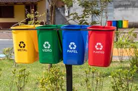

<!DOCTYPE html>
<html lang="en">
<head>
  <meta charset="UTF-8">
  <meta name="viewport" content="width=device-width, initial-scale=1.0">
  <title>Importância da Reciclagem</title>
  
</head>
<body>
  <header>
    <h1>A importância da Reciclagem</h1>
  </header>

<section>
  <h2>Redução do Impacto Ambiental</h2>
  
A reciclagem ajuda a reduzir a quantidade de resíduos enviados para aterros sanitários, preservando o meio ambiente.

  
</section>

<section>
  <h2>Economia de Recursos Naturais</h2>
  
A reciclagem permite a reutilização de materiais, como papel, plástico e metal, economizando recursos naturais preciosos. 

  
</section>

<footer>
  
&copy; 2024 Site Sobre Reciclagem. Todos os direitos reservados.

</footer>
</body>
</html>
